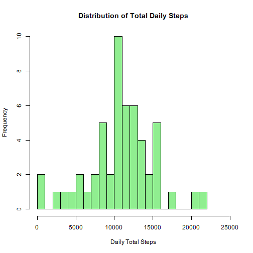
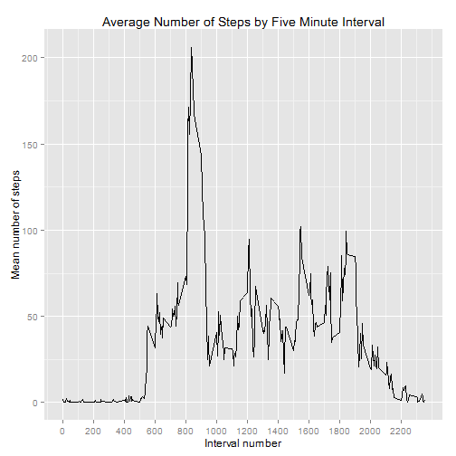
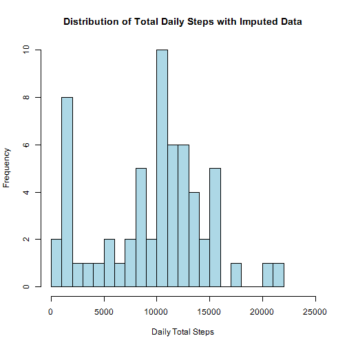
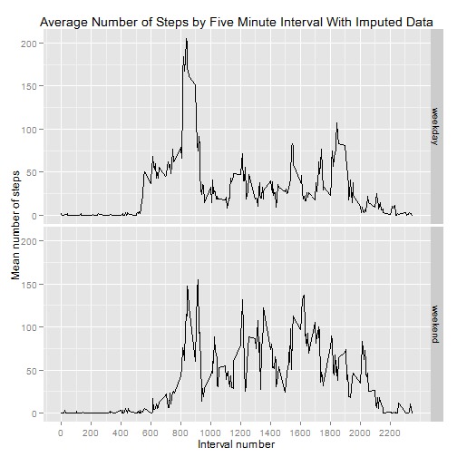

This exercise considers various attributes of data collected from a personal fitness device that collected the number of steps taken during five-minute intervals thoughout the day.  The data was collected during October and November 2012, but there are data gaps for certain intervals.  

## Loading and preprocessing the data

Prior to conducting the analyses, the data is dowloaded into the working directory, unzipped and read as a csv file.  The data contains variables for the number of steps, the date and the identifier for the five-minute interval.


```r
temp <- tempfile()
fileUrl <- "http://d396qusza40orc.cloudfront.net/repdata%2Fdata%2Factivity.zip"
download.file(fileUrl, temp)
monitoring <- read.csv(unz(temp, "activity.csv"))
unlink(temp)
```


## What is mean total number of steps taken per day?

To calculate the total number of steps taken each day, the NA values are removed and the number of the steps taken are summed by date 


```r
## Removal of NA values; "cc" reflects the complete case data 
cc <- monitoring[complete.cases(monitoring), ]
## Aggregation of total steps by date.
daily_step_data <- aggregate(cc$steps, by=list(cc$date), "sum")
```

The distribution of the total daily steps by histogram reflects a wide range of total steps taken, very roughly resembling a normal distribution.


```r
## Generation of histogram; "x" reflects number of steps in "daily_step_data"
hist(daily_step_data$x, breaks=seq(0,22000, by=1000), 
  xlim=c(0,25000), main="Distribution of Total Daily Steps", 
	xlab="Daily Total Steps", col="lightgreen")
```

 


```r
## Calculation of mean and median 
options(scipen=999)
options(digits=2)
daily_mean <- mean(daily_step_data$x)
daily_median <- median(daily_step_data$x)
```

The mean of this distribution is 10766.19 and the median of the disribution is 10765.


## What is the average daily activity pattern?

Averaging the data (with NA values removed) across each individual five-minute interval reflects significant variability in average steps taken per-interval during the course of the day. 


```r
## Calculation of mean steps by interval
average_interval_steps <- aggregate(cc$steps, by=list(cc$interval), "mean")
colnames(average_interval_steps) <- c("intervalNumber", "meanSteps")

## Plotting average number of steps by interval number
library(ggplot2)
g <- ggplot(average_interval_steps, aes(intervalNumber, meanSteps))
g + geom_line() + labs(title = "Average Number of Steps by Five Minute Interval", y = "Mean number of steps", x = "Interval number") + scale_x_continuous(breaks = seq(from = 0, to = 2355, by = 200))
```

 


```r
## Calculation of interval which produces the maximum average
interval_max <- average_interval_steps[which(average_interval_steps$meanSteps == max(average_interval_steps$meanSteps)), ]
```

The maximum average is found at interval number 835, which produces an average value of 206.17.

## Imputing missing values

A number of potential strategies are available for filling in the missing data.  Here, NAs are filled in using the median values of the available data over the relevant five minute period.  This approach has the benefits of allowing the imputed data to be tailored for the relevant five-minute period, and avoiding the outlier effects that may accompany the use of means.  


```r
## Caluation of median value for each relevant five-minute interval, using available data
median_grid <- aggregate(cc$steps, by=list(cc$interval), "median")
colnames(median_grid) <- c("interval", "steps1")

## Merging of median data into original data set, reordering resulting values by data, and replacing
## missing values with median values for the relevant period. 
## The "hybrid3" set reflects the compute data set with imputed data
hybrid1 <- merge(monitoring, median_grid, all=TRUE)
hybrid2 <- hybrid1[order(as.Date(hybrid1$date)),]
hybrid3 <- hybrid2
hybrid3$steps[is.na(hybrid3$steps)] <- hybrid3$steps1[is.na(hybrid3$steps)]

## Aggregation of total steps by date using imputed data.
hybrid_step_data <- aggregate(hybrid3$steps, by=list(hybrid3$date), "sum")
```

A histogram of total daily steps using imputed data indicates a generally similar dispersion of the data as is found without the imputed data, but with some differences. 


```r
hist(hybrid_step_data$x, breaks=seq(0,22000, by=1000), 
  xlim=c(0,25000), main="Distribution of Total Daily Steps with Imputed Data", 
	xlab="Daily Total Steps", col="lightblue")
```

 


```r
#Calculation of mean and median values using hybrid data
hybrid_mean <- mean(hybrid_step_data$x)
hybrid_median <- median(hybrid_step_data$x)
```

The imputed data produces a mean of 9503.87 (compared to the value of 10766.19 absent the imputed data).  The imputed data produces a median of 10395 (compared to the value of 10765 absent the imputed data).  

## Are there differences in activity patterns between weekdays and weekends?

Analysis of the data (including the imputed values) also indicates significant differences in average number of steps per five-minute interval when the weekday data is separated from the weekend data.


```r
## Addition of "daytype" variable to identify whether a particular date falls on a weekday or weekend.
wkday_wkend <- hybrid3
wkday_wkend$dayoweek <- weekdays(as.Date(hybrid3$date))
wkday_wkend$daytype <- as.factor(ifelse (wkday_wkend$dayoweek %in% c("Saturday", "Sunday"), "weekend", "weekday"))

## Average of steps by five-minute interval, divided by weekdays and weekends
average_weekdayweekend_steps <- aggregate(wkday_wkend$steps, by=list(wkday_wkend$interval, wkday_wkend$daytype), "mean")
colnames(average_weekdayweekend_steps) <- c("intervalNumber", "dayType", "meanSteps")

## Plotting mean steps by interval, separately accounting for weekdays and weekends.
g <- ggplot(average_weekdayweekend_steps, aes(intervalNumber, meanSteps))
g + geom_line() + facet_grid(dayType ~ .) + labs(title = "Average Number of Steps by Five Minute Interval With Imputed Data", y = "Mean number of steps", x = "Interval number") + scale_x_continuous(breaks = seq(from = 0, to = 2355, by = 200))
```

 


